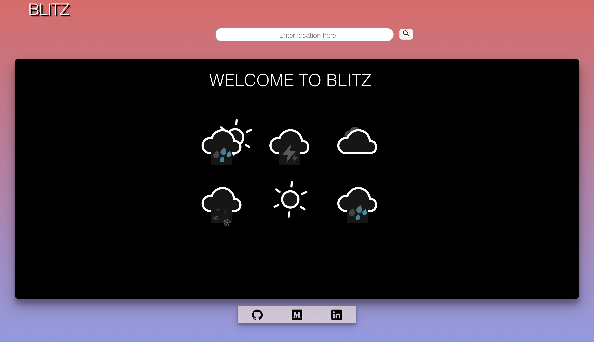
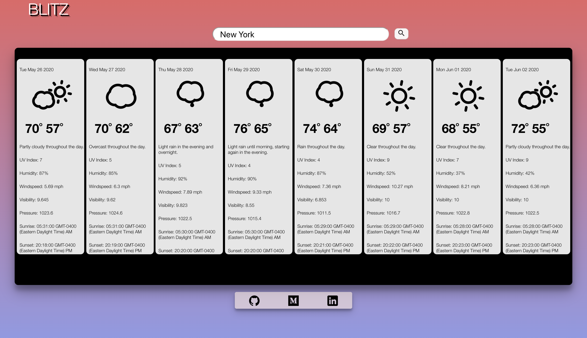

# Blitz Weather App

## *Project is deployed [here](https://blitzweatherapp.herokuapp.com/)*

A weather widget built with using the DarkSky API using a proxy server

## Getting Started

### Prerequisites
This project uses node v12.8.0 and npm v6.14.4
You will also need API keys for DarkSky (not giving out new keys currently after Apple acquistion) and MapQuest Geocoder API keys. You will also need to construct a proxy server to bypass DarkSky's strict CORS policy. I built one in Node.js linked [here](https://github.com/jtx007/Blitzproxy-server)

### Development
In order to develop the project locally, run the following commands in your terminal

```
git clone
npm install
npm start
```

## Tech Stack
- React 16.11.0
- HTML/CSS




